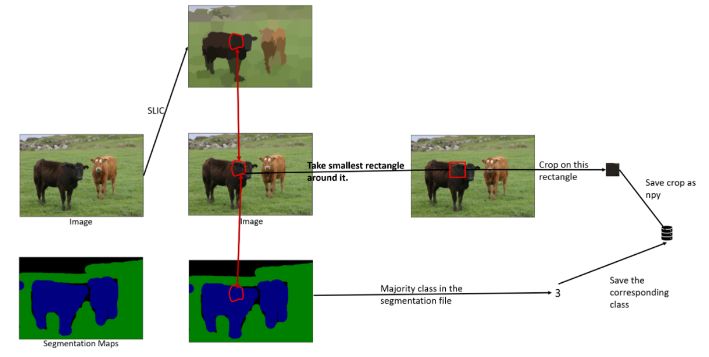
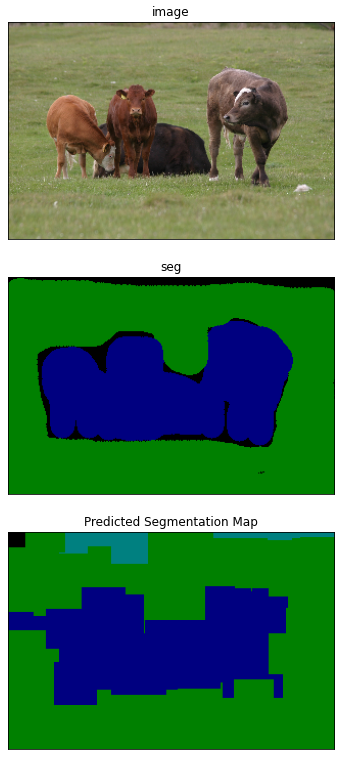

# Slic-Superpixel-Image-Segmentation
Image Segmentation using SLIC Superpixels and zoom-out features.

The goal of this project is to build a segmentation network, which uses SLIC Superpixels as input. In essense, it will be a classifier for superpixels. The end product is a system which, when given an image, computes superpixels and classifies each superpixel as one of the 9 classes of MSRC v1.
We reformulate the Superpixels semantic segmentation problem into an easier problem of image classification. There are basically four steps in the training stage.

-Dilate and save each superpixel region from SLIC output into image of dimension 3X224X224, alongwith the ground truth segments label. To improve accuracy we use Zoom out features for semantic segmentation by using multiview images - [Paper](https://arxiv.org/pdf/1412.0774.pdf).

-Build a couple of convolution layers to extract the deep features from each Superpixel patch image. Let the last layer be Fully connected layers.

-Define the segmentation loss as multi-class classification loss and train a convolutional neural network based classifier.

-During inference, we combine the classifier's predicted labels to form the whole input image's Superpixel segmentation results.

---

## Pipeline

---

## Result

